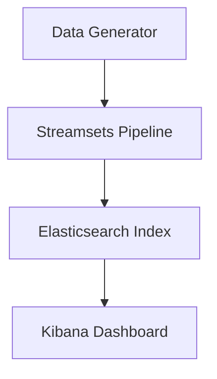

Voici un exemple de fichier **README** complet pour ton projet **Sales Monitoring Dash**. 

---

# Sales Monitoring Dash

**Sales Monitoring Dash** est une solution automatisée pour générer, traiter et analyser des données de ventes. Le projet utilise des outils comme **ELK Stack** (Elasticsearch, Logstash, Kibana) et **Streamsets** pour créer des pipelines de données robustes, permettant une visualisation en temps réel des indicateurs clés.

## 📋 Table des matières

1. [Fonctionnalités](#-fonctionnalités)
2. [Architecture](#-architecture)
3. [Installation](#-installation)
4. [Utilisation](#-utilisation)
5. [Technologies Utilisées](#-technologies-utilisées)
6. [Roadmap](#-roadmap)
7. [Contribuer](#-contribuer)
8. [Licence](#-licence)

---

## 🚀 Fonctionnalités

- **Génération de données fictives** :
  - Création de données simulant des ventes (clients, produits, prix, dates).
- **Pipeline de traitement des données** :
  - Utilisation de **Streamsets** pour automatiser l'ingestion des données dans Elasticsearch.
- **Indexation des données** :
  - Structuration des données pour des recherches efficaces via Elasticsearch.
- **Analyse et visualisation** :
  - Dashboards interactifs dans **Kibana** pour suivre les KPI (ventes totales, produits les plus vendus, tendances temporelles).

---

## ⚙️ Architecture



---

## 🛠️ Installation

### Prérequis
- [Docker](https://www.docker.com/) installé
- **Python 3.8+** pour la génération de données
- Outils ELK : Elasticsearch, Logstash, Kibana
- [Streamsets Data Collector](https://streamsets.com/)

### Étapes
1. **Cloner le projet** :
   ```bash
   git clone https://github.com/username/sales-monitoring-dash.git
   cd sales-monitoring-dash
   ```

2. **Configurer ELK avec Docker Compose** :
   Crée un fichier `docker-compose.yml` pour Elasticsearch, Logstash et Kibana :
   ```yaml
   version: '3.8'
   services:
     elasticsearch:
       image: docker.elastic.co/elasticsearch/elasticsearch:8.10.0
       container_name: elasticsearch
       ports:
         - "9200:9200"
       environment:
         - discovery.type=single-node
     kibana:
       image: docker.elastic.co/kibana/kibana:8.10.0
       container_name: kibana
       ports:
         - "5601:5601"
   ```

   Lance les services :
   ```bash
   docker-compose up -d
   ```

3. **Installer les dépendances Python** :
   ```bash
   pip install faker elasticsearch
   ```

4. **Lancer Streamsets** :
   Configure un pipeline pour lire les données et les envoyer dans Elasticsearch.

---

## 🧑‍💻 Utilisation

### Génération de données fictives
Lance le script `data_generator.py` pour générer des données :
```bash
python data_generator.py
```

### Pipeline Streamsets
1. Configure une source pour lire les données générées.
2. Utilise un destinataire pour indexer les données dans Elasticsearch.

### Dashboards Kibana
1. Accède à Kibana via `http://localhost:5601`.
2. Crée un index pattern pour les données.
3. Construis des visualisations (graphiques, diagrammes, etc.).

---

## 🛠️ Technologies Utilisées

- **Python** pour générer des données fictives.
- **Streamsets Data Collector** pour les pipelines de données.
- **Elasticsearch** pour l'indexation et la recherche.
- **Kibana** pour les visualisations.
- **Docker** pour le déploiement local.

---

## 🗺️ Roadmap

- [x] Génération de données fictives
- [x] Configuration de ELK Stack
- [x] Création des pipelines Streamsets
- [ ] Ajout d'alertes en temps réel (par ex., seuils de ventes)
- [ ] Déploiement sur un environnement cloud (AWS/Azure)

---

## 🤝 Contribuer

Les contributions sont les bienvenues ! Suivez ces étapes :
1. Fork le projet.
2. Crée une branche pour ta fonctionnalité (`git checkout -b feature/ma-fonctionnalité`).
3. Envoie une PR une fois terminé.

---

## 📄 Licence

Ce projet est sous licence MIT. Consulte le fichier `LICENSE` pour plus d'informations.

---

Qu’en penses-tu ? Je peux ajuster selon tes besoins ou ajouter des sections si nécessaire ! 🚀